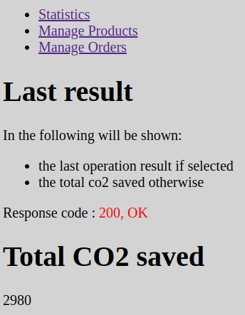

[![Issues][issues-shield]][issues-url]
[![LinkedIn][linkedin-shield]][linkedin-url]

<!-- PROJECT LOGO -->
<br />
<div align="center">
  <h3 align="center">PHP e MySQL - Food</h3>
  
  <p align="center">Project created for <strong>Start2Impact</strong> course: <em>PHP & MySQL project</em></p>
</div>

### Built With

* [HTML 5](https://developer.mozilla.org/en-US/docs/Glossary/HTML)
* [CSS 3](https://developer.mozilla.org/en-US/docs/Web/CSS)
* [PHP](https://www.php.net/manual/en/getting-started.php) (follow also the [Laracats](https://laracasts.com/series/php-for-beginners) series)
* [MySQL](https://dev.mysql.com/doc/mysql-getting-started/en/) (or get the following italian only [guide](https://www.html.it/guide/guida-mysql/))
* or alternatively follow [this](https://www.html.it/pag/52749/impostare-un-ambiente-php-su-linux/) guide (italian only)
* [REST API](https://www.html.it/guide/rest-api-e-database-la-guida/) (italian only); the project follows the REST API convention 

<!-- TABLE OF CONTENTS -->
<details open="open">
  <summary>Table of Contents</summary>
  <ol>
    <li><a href="#getting-started">Getting Started</a></li>
    <li><a href="#usage">Usage</a></li>
    <li><a href="#contact">Contact</a></li>
  </ol>
</details>

<!-- GETTING STARTED -->
## Getting Started

1. Clone the repo

```sh
git clone git@github.com:matteorazzanelli/kreas-food-php.git
```

2. Project setup: if you have both *mysql* and *lampp* environment installed, this may cause conflict; to resolve this just type 
```
service mysql stop
```
```
sudo /opt/lampp/lampp restart
```

3. Choose if you want to display frontend or not by writing TRUE or FALSE in *example.env* file
```
FRONTEND=<true_or_false>
```

4. Go to [phpMyAdmin](http://localhost/phpmyadmin/index.php) (eventually follow [thish](ttps://www.digitalocean.com/community/tutorials/how-to-install-and-secure-phpmyadmin-on-ubuntu-20-04) guide); go to the *Import* section, choose the *migrations.sql* file taht is present in this folder and click on the *Import* button at the bottom. 

4. Go to work directory
```
cd kreas-food-php
```

5. Run local php server
```
php -S localhost:8000
```

6. Go to http://localhost:8000

<!-- USAGE -->
## Usage

- The home page shows the total CO2 saved in total
- If you want to filter the CO2 saved by product name, country, or time range, just type at least one of them in the fields below the section *Filter by*
  - N.B. the time range must be present both or none of them
- *Manage Products* allows you to add, delete or modify some product
- *Manage Orders* allows you to add, delete or modify some orders
- In each page the following sentences is present
```
Response code : <STATUS_CODE>, <MESSAGE>
```
where STATUS_CODE shows the response code of the previous request, while MESSAGE shows a more informative response for the user.

## REST API
The term REST is used to describe any type of interface capable of transmitting data by means of the HTTP protocol.

The client will be responsible for requesting a service from the server, which will instead be responsible for providing it. 

Suppose we have to develop a web application capable of processing the four CRUD (Create, Read, Update, Delete) operations. Our application, which will be nothing more than a PHP application, will have the task of calling, via a web API, an external service that will perform one of the CRUD operations.

Essentiually, the REST interface is all but the mapping function between HTTP and CRUD methods.

In this project the REST API are the methods of the Controllers' class in the OrdersController.php, ProductsController.php and StatisticsController.php files. Thus, the REST interface is represented by the set of all the methods defined in these classes.

<!-- CONTACT -->
## Link & Contact

Matteo Razzanelli - matteo.razzanelli89@gmail.it

Start2impact personal page - https://talent.start2impact.it/profile/matteo-razzanelli

Project Repository: [PHP & MySQL App](https://github.com/matteorazzanelli/kreas-food-php)

<!-- MARKDOWN LINKS & IMAGES -->
[issues-shield]: https://img.shields.io/github/issues/matteorazzanelli/kreas-food-php/repo.svg?style=for-the-badge
[issues-url]: https://github.com/matteorazzanelli/kreas-food-php/issues
[linkedin-shield]: https://img.shields.io/badge/-LinkedIn-black.svg?style=for-the-badge&logo=linkedin&colorB=555
[linkedin-url]: https://www.linkedin.com/in/matteo-razzanelli/